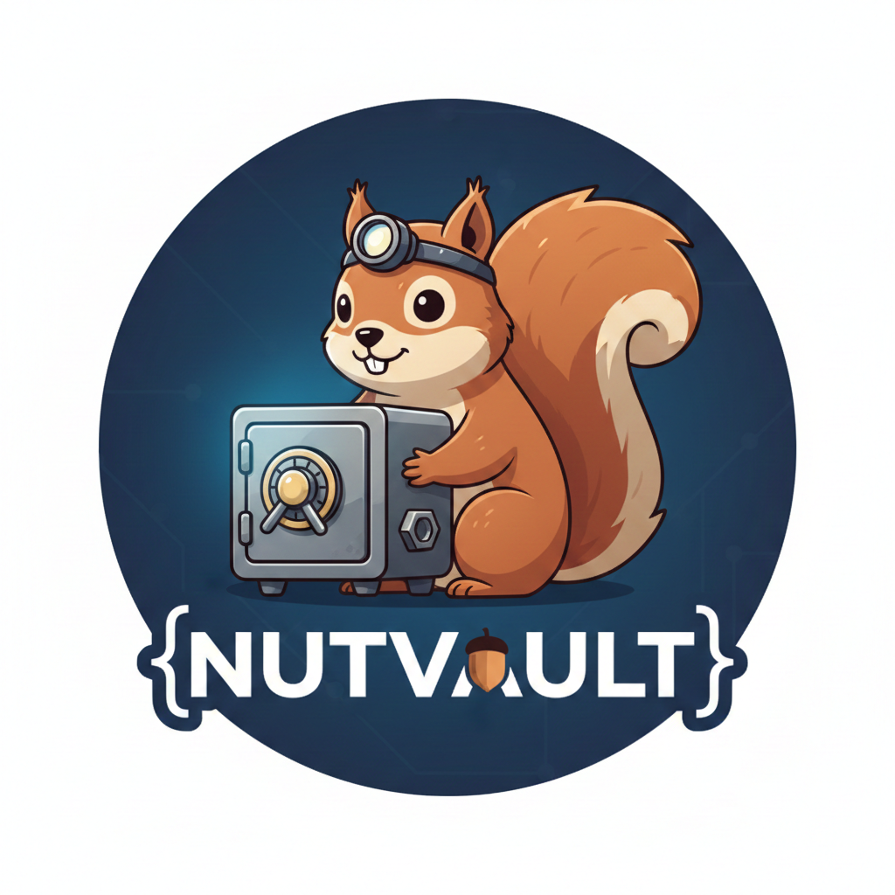

# nutvault



## Usage

nutvault is a CLI tool for managing encrypted environment variable vaults. It provides secure storage and retrieval of environment variables from `.env` files.

### Commands

#### Collect

Collect variables from a `.env` file and save them to a vault project.

```bash
# Collect from default .env file with default key
nutvault collect myproject

# Collect from custom .env file
nutvault collect myproject --env-file .env.production

# Collect with custom key file
nutvault collect myproject --key-file ~/.nutvault/mykey.hex
```

The `collect` command reads all variables from a `.env` file and saves them to an encrypted vault project. The project is stored at `~/.nutvault/projects/<projectName>.<hash>`.

#### Fill

Fill empty variables in a `.env` file with values from the vault.

```bash
# Fill empty variables in default .env file
nutvault fill myproject

# Fill empty variables in custom .env file
nutvault fill myproject --env-file .env.production

# Fill with custom key file
nutvault fill myproject --key-file ~/.nutvault/mykey.hex
```

The `fill` command reads variables from a vault project and fills only empty variables in a `.env` file. Variables that already have values are not modified.

#### Swap

Replace all variable values in a `.env` file with values from the vault.

```bash
# Swap all variables in default .env file
nutvault swap myproject

# Swap all variables in custom .env file
nutvault swap myproject --env-file .env.production

# Swap with custom key file
nutvault swap myproject --key-file ~/.nutvault/mykey.hex
```

The `swap` command reads variables from a vault project and replaces all variable values in a `.env` file. All existing variable values will be overwritten with values from the vault.

#### Remove

Delete a vault project and all its contents.

```bash
# Remove project with default key
nutvault remove myproject

# Remove project with custom key file
nutvault remove myproject --key-file ~/.nutvault/mykey.hex
```

The `remove` command deletes an entire vault project and all its contents. This operation cannot be undone.

#### List

List all vault projects.

```bash
# List all projects
nutvault list
```

The `list` command displays all vault projects stored in `~/.nutvault/projects/`. For each project, it shows the project name, hash, path, and number of variables.

#### Value Set

Set or update a variable value in a vault project.

```bash
# Set a variable with default key
nutvault value-set myproject API_KEY secret123

# Set a variable with custom key file
nutvault value-set myproject API_KEY secret123 --key-file ~/.nutvault/mykey.hex
```

The `value-set` command sets or updates a single variable in a vault project. If the variable already exists, its value will be overwritten.

#### Value Remove

Remove a variable from a vault project.

```bash
# Remove a variable with default key
nutvault value-remove myproject API_KEY

# Remove a variable with custom key file
nutvault value-remove myproject API_KEY --key-file ~/.nutvault/mykey.hex
```

The `value-remove` command deletes a single variable from a vault project. This operation cannot be undone for that specific variable.

#### Value Get

Get a variable value from a vault project.

```bash
# Get a variable with default key
nutvault value-get myproject API_KEY

# Get a variable with custom key file
nutvault value-get myproject API_KEY --key-file ~/.nutvault/mykey.hex
```

The `value-get` command retrieves a single variable from a vault project and displays it in `KEY=value` format. The command will return an error if the variable does not exist.

#### Value List

List all variables in a vault project.

```bash
# List all variables with default key
nutvault value-list myproject

# List all variables with custom key file
nutvault value-list myproject --key-file ~/.nutvault/mykey.hex
```

The `value-list` command displays all variables from a vault project in `KEY=value` format, one variable per line.

### Options

- `--env-file, -e`: Path to `.env` file (default: `.env` in current directory)
- `--key-file, -k`: Path to key file in hex format (default: use default user key)

### Key Files

If no key file is specified, nutvault uses a default key generated deterministically from your user and host information. For custom encryption keys, provide a key file containing exactly 64 hex characters (32 bytes).

## Installation

### Download from GitHub Releases

You can download the latest pre-built binary for your platform from [GitHub Releases](https://github.com/adeptofvoltron/nutvault/releases/latest).

#### Linux (amd64)

```bash
curl -sL https://github.com/adeptofvoltron/nutvault/releases/download/v1.1.0/nutvault-linux-amd64 -o /usr/local/bin/nutvault
chmod +x /usr/local/bin/nutvault
```

#### Linux (arm64)

```bash
curl -sL https://github.com/adeptofvoltron/nutvault/releases/download/v1.1.0/nutvault-linux-arm64 -o /usr/local/bin/nutvault
chmod +x /usr/local/bin/nutvault
```

#### macOS (amd64)

```bash
curl -sL https://github.com/adeptofvoltron/nutvault/releases/download/v1.1.0/nutvault-darwin-amd64 -o /usr/local/bin/nutvault
chmod +x /usr/local/bin/nutvault
```

#### macOS (arm64)

```bash
curl -sL https://github.com/adeptofvoltron/nutvault/releases/download/v1.1.0/nutvault-darwin-arm64 -o /usr/local/bin/nutvault
chmod +x /usr/local/bin/nutvault
```

#### Windows

Download `nutvault-windows-amd64.exe` from the releases page and add it to your PATH.

Or use curl:

```bash
curl -sL https://github.com/adeptofvoltron/nutvault/releases/download/v1.1.0/nutvault-windows-amd64.exe -o nutvault.exe
```

### Build from Source

```bash
git clone https://github.com/adeptofvoltron/nutvault.git
cd nutvault
go build -o nutvault ./cmd/nutvault
```

## Releasing a New Version

To create a new release and publish binaries to GitHub Releases:

1. **Build binaries for all platforms:**
   ```bash
   ./release.sh
   ```
   This will create binaries in the `dist/` directory for:
   - Linux (amd64, arm64)
   - macOS (amd64, arm64)
   - Windows (amd64, arm64)

2. **Create and push a Git tag:**
   ```bash
   git tag -a vX.Y.Z -m "release X.Y.Z"
   git push origin vX.Y.Z
   ```

3. **Create a GitHub Release using GitHub CLI:**
   ```bash
   gh release create vX.Y.Z dist/* --title "vX.Y.Z" --notes "Release notes"
   ```
   
   Or create the release manually on GitHub and upload the files from the `dist/` directory.

The `release.sh` script builds optimized binaries with `-ldflags "-s -w"` for smaller file sizes and automatically generates SHA256 checksums for each binary.

